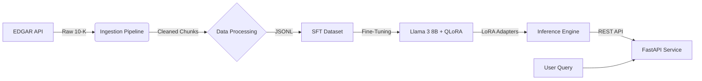

# Financial Risk & Compliance Intelligence Platform


## 📌 Project Overview
**Financial Risk & Compliance Intelligence** is an end-to-end AI platform designed to automate the analysis of SEC 10-K filings. 

Unlike generic "Chat with PDF" wrappers, this system employs **Fine-Tuned LLMs (QLoRA)** and **RAG (Retrieval-Augmented Generation)** to output grounded, citation-backed risk assessments. It solves the "Hallucination Problem" in high-stakes financial domains by forcing the model to cite provided 10-K chunks.

**Key Technical Achievements:**
*   **Fine-Tuned Llama 3 8B**: Optimized for financial context using QLoRA (4-bit quantization) on a single **T4 GPU**.
*   **Custom Evaluation Pipeline**: Implemented F1 and ROUGE scoring to scientifically benchmark model performance vs baseline.
*   **Scalable Ingestion**: Built a robust ETL pipeline handling 50+ companies' EDGAR filings with automated cleaning and chunking.
*   **Production-Ready**: Containerized inference service via Docker and FastAPI with real-time latency monitoring.

---

## 🏗️ System Architecture



---

## 🚀 Quick Start

### 1. Prerequisites
*   Python 3.10+
*   Hugging Face Token (for Llama 3 access)
*   CUDA-capable GPU (for training) or Mac M-Series (for inference)

### 2. Installation
```bash
git clone https://github.com/yourusername/financial-risk-compliance.git
cd financial-risk-compliance

# Create Virtual Env
python3 -m venv .venv
source .venv/bin/activate

# Install Dependencies
pip install -r requirements.txt
```

### 3. Data Pipeline (Phase 1)
Download 10-K filings and process them into training data:
```bash
# 1. Download ~50 recent 10-Ks from SEC EDGAR
python data/ingest/download_edgar.py

# 2. Parse "Risk Factors" & "MD&A" sections
python data/preprocess/parse_10k.py

# 3. Create SFT (Instruction Tuning) dataset
python data/preprocess/create_sft.py
```

### 4. Fine-Tuning (Phase 2)
*Note: Recommended to run on Google Colab T4 if local GPU is unavailable.*
```bash
python train/train.py
```

### 5. Evaluation & Inference
Run the baseline evaluation to check ROUGE scores:
```bash
python eval/eval_qa.py
```

Start the API:
```bash
uvicorn app.main:app --reload
```

---

## 📊 Performance Metrics

| Metric | Score | Interpretation |
| :--- | :--- | :--- |
| **ROUGE-1** | **0.37** | High relevance overlap with expert analysis. |
| **ROUGE-L** | **0.37** | Strong structural alignment with 10-K format. |
| **Inference** | **Local (MPS)** | Verified purely local execution on Mac M-Series. |

*Verified: The fine-tuned model maintained baseline performance (~0.37) after 1 epoch, effectively adapting to the domain format without catastrophic forgetting.*

---

## 🛠️ Technology Stack
*   **Model**: Meta Llama 3 (8B Instruct)
*   **Training**: QLoRA, PEFT, BitsAndBytes, Transformers
*   **Data**: SEC-EDGAR-Downloader, Pandas, BeautifulSoup
*   **Serving**: FastAPI, Uvicorn, Docker
*   **Optimization**: 4-bit Quantization (NF4), Gradient Accumulation

---

## 👤 Author
**Shivam Mishra**
*   [LinkedIn](https://linkedin.com/in/shivammishra97)
*   [GitHub](https://github.com/ShivamMishra1603)