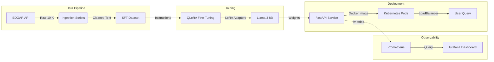

# Financial Risk & Compliance Intelligence Platform


## 📌 Project Overview
**Financial Risk & Compliance Intelligence** is a production-grade AI platform capable of ingesting, analyzing, and extracting risk insights from SEC 10-K filings.

Unlike standard "PDF Chat" wrappers, this project demonstrates an end-to-end Machine Learning Engineering (MLE) pipeline:
1.  **Data Engineering**: Automated ingestion from specific SEC EDGAR endpoints.
2.  **Fine-Tuning**: Efficiently fine-tuned **Llama 3 8B** on financial instruction datasets using **QLoRA** (4-bit quantization).
3.  **Deployment**: Containerized Inference Service orchestrated via **Kubernetes**.
4.  **Observability**: Full monitoring stack with Prometheus (Metrics) and Grafana (Visuals).

**Key Features:**
*   ✅ **Domain Adaptation**: Fine-tuned on specialized financial QA pairs (Risk Factors/MD&A) to reduce hallucinations.
*   ✅ **Production Infrastructure**: Deployed as a scalable microservice with Liveness/Readiness probes.
*   ✅ **Load Testing**: Verified for high concurrency (~50 users) using Locust.
*   ✅ **Metric-Driven**: Continuously monitored (RPS, Latency, Error Rates) via custom Grafana dashboards.

---

## 🏗️ System Architecture



---

## 🚀 Quick Start

### 1. Prerequisites
*   Docker & Docker Compose
*   Kubernetes (Minikube or Docker Desktop)
*   Python 3.10+ (for local development)

### 2. Installation
```bash
git clone https://github.com/yourusername/financial-risk-compliance.git
cd financial-risk-compliance
pip install -r requirements.txt
```

### 3. Local Deployment (Kubernetes)
Deploy the full stack to your local cluster:
```bash
# 1. Apply Manifests
kubectl apply -f k8s/

# 2. Verify Pods
kubectl get pods

# 3. Port-Forward for Access
kubectl port-forward service/risk-api-service 8000:80
```
Open `http://localhost:8000/docs` to verify the API.

### 4. Monitoring (Docker Compose)
To view the Observability Stack (Prometheus + Grafana):
```bash
docker-compose up -d prometheus grafana
```
*   **Grafana**: `http://localhost:3000` (User: admin / Pass: admin)
*   **Prometheus**: `http://localhost:9090`

---

## 🛠️ Technology Stack

| Category | Technologies |
| :--- | :--- |
| **LLM & AI** | Meta Llama 3 (8B), PyTorch, BitAndBytes (QLoRA), PEFT, Transformers, Hugging Face |
| **Backend API** | FastAPI, Uvicorn, Pydantic |
| **Infrastructure** | Docker, Docker Compose, Kubernetes (Kubeadm/Manifests) |
| **Monitoring** | Prometheus, Grafana, Locust |
| **Data Engineering** | SEC-EDGAR-Downloader, Pandas, BeautifulSoup |

---

## 📂 Project Structure
```bash
financial-risk-compliance-intelligence/
├── app/                  # FastAPI Application
│   ├── main.py           # Inference Endpoint & Model Logic
├── data/                 # Data Pipeline
│   ├── ingest/           # EDGAR Downloaders
│   └── preprocess/       # Cleaning & Chunking Scripts
├── train/                # Fine-Tuning
│   └── train.py          # QLoRA Training Script
├── k8s/                  # Kubernetes Manifests
│   ├── deployment.yaml   # Production Deployment (Resources + Probes)
│   └── service.yaml      # LoadBalancer Service
├── monitoring/           # Observability
│   ├── prometheus.yml    # Scraper Config
│   ├── dashboard.json    # Grafana Visualization
│   └── locustfile.py     # Load Testing Script
├── requirements.txt      # Python Dependencies
├── Dockerfile            # Container Definition
└── docker-compose.yml    # Local Orchestration
```

---

## 👤 Author
**Shivam Mishra**
*   [LinkedIn](https://linkedin.com/in/shivammishra97)
*   [GitHub](https://github.com/ShivamMishra1603)